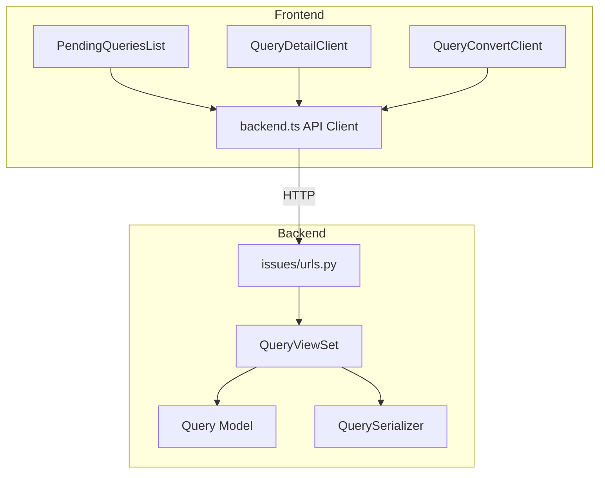

# Design Document: Pending Queries Management

## Overview

This design addresses the Pending Queries Management feature for the NSJ application. The feature enables admin/sales staff to manage customer queries throughout their lifecycle - from initial inquiry to order conversion or archival. The implementation requires fixing the API endpoint mismatch between frontend and backend, and ensuring all query operations work correctly.

The core issue is that the frontend API client (`backend.ts`) is calling `/payments/queries/` endpoints, but the backend serves queries at `/issues/queries/`. This design provides the fix and ensures all query management actions work properly.

## Architecture



## Components and Interfaces

### Backend Components (Existing - Need URL Fix)

**QueryViewSet** (`issues/views.py`)
- `list()` - Returns paginated queries with optional status/search filters
- `retrieve()` - Returns single query details
- `create()` - Creates new query
- `partial_update()` - Updates query fields
- `destroy()` - Deletes query
- `archive()` - Archives a pending query
- `reopen()` - Reopens an archived query
- `convert_to_order()` - Converts query to order
- `auto_archive()` - Batch archives expired queries

**Query Model** (`issues/models.py`)
- UUID primary key
- Foreign keys: account, item_name, created_by
- Fields: gold_carat, gender, size, location, delivery_type, query_in_date, expiry_date, reference_image, status
- Methods: `is_expired()`, `auto_archive_if_expired()`, `to_dict()`

### Frontend Components

**API Client** (`lib/backend.ts`)
- `queryList(params)` - Fetch paginated queries
- `queryDetail(id)` - Fetch single query
- `queryUpdate(id, payload)` - Update query
- `queryArchive(id)` - Archive query
- `queryReopen(id)` - Reopen archived query
- `queryConvertToOrder(id, payload)` - Convert to order

**Constants** (`lib/constants.ts`)
- Add QUERIES endpoints under ISSUES namespace

**UI Components**
- `PendingQueriesList` - List view with search/filter
- `QueryDetailClient` - Detail view with actions
- `QueryConvertPage` - Conversion form (new)

## Data Models

### Query (Backend Model - Existing)
```python
class Query:
    id: UUID
    account: ForeignKey[Account]
    item_name: ForeignKey[ItemNameMaster]
    gold_carat: str
    gender: str | None
    size: str
    location: str | None
    delivery_type: str | None
    query_in_date: date
    expiry_date: date | None
    reference_image: FileField | None
    status: Literal["pending", "converted_to_order", "archived", "rejected"]
    created_by: ForeignKey[User]
    created_at: datetime
    updated_at: datetime
```

### QueryResponse (Frontend Type - Existing)
```typescript
type QueryResponse = {
    id: string;
    account?: { id: string; account_name: string; name: string } | null;
    item_name?: { id: string; name: string } | null;
    gold_carat: string;
    gender?: string | null;
    size: string;
    location?: string | null;
    delivery_type?: string | null;
    query_in_date: string;
    expiry_date?: string | null;
    reference_image?: string | null;
    status: 'pending' | 'converted_to_order' | 'archived' | 'rejected';
    is_expired: boolean;
    created_at: string;
    updated_at: string;
};
```

## Correctness Properties

*A property is a characteristic or behavior that should hold true across all valid executions of a system-essentially, a formal statement about what the system should do. Properties serve as the bridge between human-readable specifications and machine-verifiable correctness guarantees.*

### Property 1: Pending status filter returns only pending queries
*For any* set of queries with mixed statuses, when filtering by status="pending", all returned queries SHALL have status equal to "pending".
**Validates: Requirements 1.1**

### Property 2: Query list response contains all required fields
*For any* query in the list response, the serialized object SHALL contain: id, account, item_name, gold_carat, size, query_in_date, expiry_date, status, and is_expired fields.
**Validates: Requirements 1.2, 7.1**

### Property 3: Expiry detection is date-accurate
*For any* query with an expiry_date, the is_expired property SHALL return true if and only if the current date is after the expiry_date.
**Validates: Requirements 1.4, 6.1**

### Property 4: Search filters match expected fields
*For any* search term, the returned queries SHALL only include queries where account_name, item_name, or gold_carat contains the search term (case-insensitive).
**Validates: Requirements 1.5**

### Property 5: Query detail returns complete object
*For any* valid query ID, the detail endpoint SHALL return all query fields including nested account and item_name objects.
**Validates: Requirements 2.2, 7.2**

### Property 6: Update persists changes and updates timestamp
*For any* query update operation, the updated_at timestamp SHALL be greater than or equal to the previous updated_at value, and the updated fields SHALL reflect the new values.
**Validates: Requirements 2.5**

### Property 7: Conversion creates order and updates status
*For any* pending query, when convert_to_order is called, the system SHALL create a new Order record AND update the query status to "converted_to_order".
**Validates: Requirements 3.3, 3.4, 7.3**

### Property 8: Status transitions follow valid state machine
*For any* query, archive SHALL only succeed when status is "pending", reopen SHALL only succeed when status is "archived", and convert_to_order SHALL only succeed when status is "pending".
**Validates: Requirements 3.6, 4.3, 5.3**

### Property 9: Archive updates status correctly
*For any* pending query, when archive is called, the query status SHALL change to "archived".
**Validates: Requirements 4.1, 7.4**

### Property 10: Reopen updates status correctly
*For any* archived query, when reopen is called, the query status SHALL change to "pending".
**Validates: Requirements 5.1, 7.5**

### Property 11: Auto-archive processes all expired pending queries
*For any* set of queries, when auto_archive is called, all queries with status="pending" AND expiry_date < current_date SHALL have their status updated to "archived".
**Validates: Requirements 6.2**

### Property 12: API errors return proper structure
*For any* failed API operation, the response SHALL include an HTTP status code >= 400 and a response body with an "error" or "detail" field containing a descriptive message.
**Validates: Requirements 7.6**

## Error Handling

### Backend Error Responses
- 400 Bad Request: Invalid status transition (e.g., archiving non-pending query)
- 401 Unauthorized: Missing or invalid authentication token
- 404 Not Found: Query ID does not exist
- 500 Internal Server Error: Unexpected server errors

### Frontend Error Handling
- Display toast notifications for API errors
- Show inline validation errors for form fields
- Graceful degradation with loading states and error boundaries

## Testing Strategy

### Dual Testing Approach

This feature requires both unit tests and property-based tests:

**Unit Tests** verify specific examples and edge cases:
- Test API endpoint routing is correct
- Test specific error messages for invalid operations
- Test UI component rendering

**Property-Based Tests** verify universal properties across all inputs:
- Use `hypothesis` library for Python backend tests
- Generate random queries with various statuses and dates
- Verify properties hold across many random inputs
- Minimum 100 iterations per property test

### Property-Based Testing Framework
- Backend: `hypothesis` (Python)
- Each property test tagged with: `**Feature: pending-queries-management, Property {N}: {description}**`

### Test Categories

1. **API Endpoint Tests**
   - Verify correct URL routing (`/issues/queries/` not `/payments/queries/`)
   - Test all CRUD operations
   - Test custom actions (archive, reopen, convert_to_order)

2. **Status Transition Tests**
   - Property tests for valid state machine transitions
   - Error cases for invalid transitions

3. **Expiry Logic Tests**
   - Property tests for is_expired calculation
   - Auto-archive batch processing

4. **Search/Filter Tests**
   - Property tests for search matching logic
   - Status filter accuracy

5. **Frontend Integration Tests**
   - API client calls correct endpoints
   - Error handling displays appropriate messages
